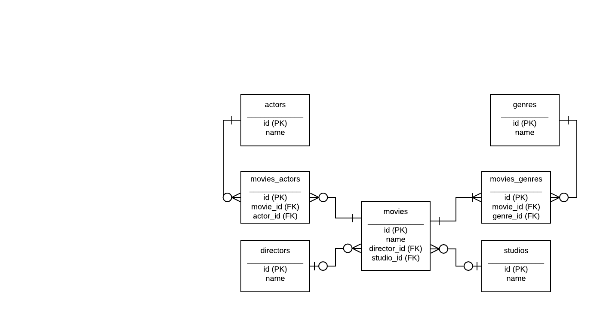

# Projet Angular

Ce repositoire présente mon logiciel pour gérer une base de données de cinéma avec Angular.
Guide:

* Instalation
    * Base de données
    * Exécution
* Modèle E-R conçu pour la base de données
* Features du logiciel

## Instalation

Il faut avoir Angular 9 mis à jour (la version de développement était 9.1.3), NodeJS, MySQL ou MariaDB (qui, d'ailleurs, utilise exactement et litéralement les mêmes commands et packages NPM).

### Base de Données

J'ai mis un fichier .sql avec des instructions pour génerer la base de données. Vous pouvez ouvrir le terminal, se connecter à mysql (par exemple `mysql -u root -p` ) et éxecuter directement le fichier comme source, ou quelque autre façon.

Ensuite, aller au dossier `database/entry.js` et changer les configurations de la base de données (mettre ses propres infos, comme mot de passe etc).

### Exécution

Aller au dossier (avec Angular mis à jour) et exécuter `npm install` pour qu'il télecharge les packages nécéssaires. Après quelques minutes cela sera fini. On utilise alors deux terminaux dans le dossier "racine". Pour le premier, nous faisons `ng serve -o` (ou juste `ng serve` et on va à `http://localhost:4200/`). Pour le second, nous faisons `node ./database/entry.js`. C'est tout!

## Modèle ER conçu pour la base de données

Voici un déssin montrant le modèle entité-relation conçu. On a prévu la possibilité des plusieurs acteurs et genres au même film, mais qu'un réalisateur et qu'un studio (peut-être il y a des excéptions, mais ce choix est pertinent au cadre du logiciel).

## _Features_ du logiciel
Le logiciel possède les features suivantes :

* Ajouter un film
* Ajouter des studios, réalisateurs, acteurs (*)
* Sélectionner un film pour ouvrir ses détails
* Changer nom du film, d'un acteur, d'un réalisateur ou d'un studio (**)
* Déléter un film, acteur, réalisateur ou studio
* Faire une recherche intéligente qui cherche tous les films, acteurs, réalisateurs, studios et genres qui présentent le terme de recherche dans leur propriétés `name` et rendre les films associés à ces entités (Alors, chercher "Tru" rend le film "True Love" s'il est dans la base, mais rend aussi tous les films associés au réalisateur François Truffaut)

(*) Je n'ai pas donné l'ajout de genres à l'utilisateur pour améliorer son expérience. Mon avis, c'est que contrariement aux autres entités, un genre de cinéma est un concept partagé par tous et il est agréable de juste les choisir.
(**) avec mise à jour pour tous les films, puisque la base est rélationnelle)